Physically Based Rendering Shader
=================================

  

  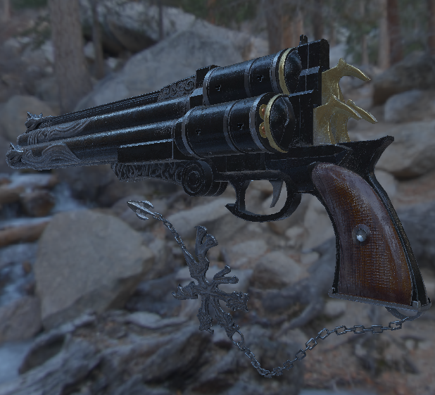

  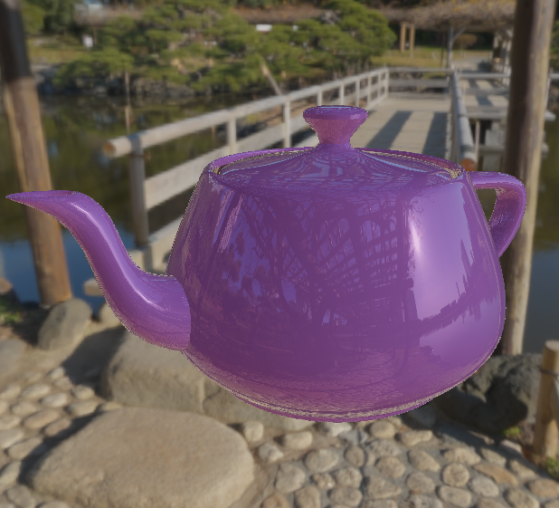

  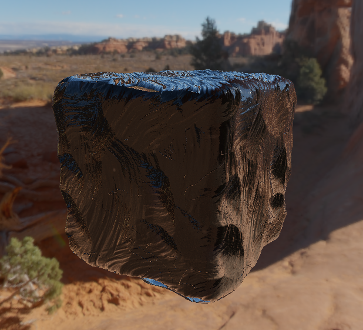

Material Properties
-------------------

<table>
  <tr>
    <th></th>
    <th scope="col">0% Metallic</th>
    <th scope="col">25% Metallic</th>
    <th scope="col">100% Metallic</th>
  </tr>
  <tr>
    <th scope="row">0% Roughness</th>
    <td></td>
    <td>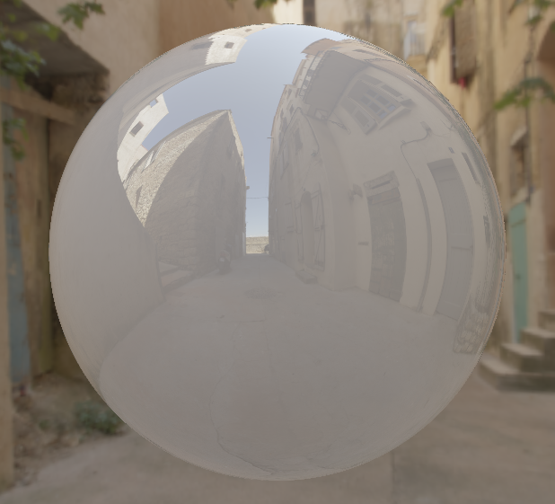</td>
    <td>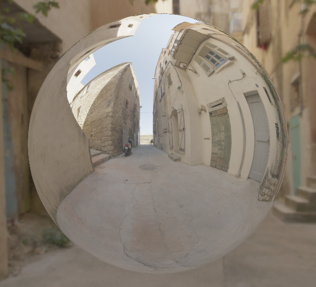</td>
  </tr>
  <tr>
    <th scope="row">25% Roughness</th>
    <td>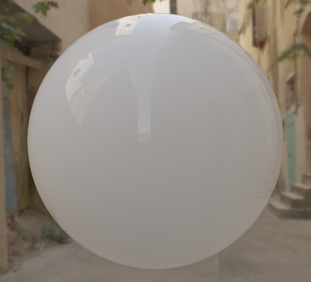</td>
    <td>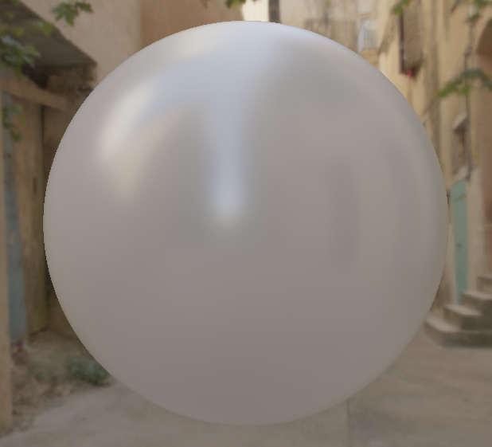</td>
    <td>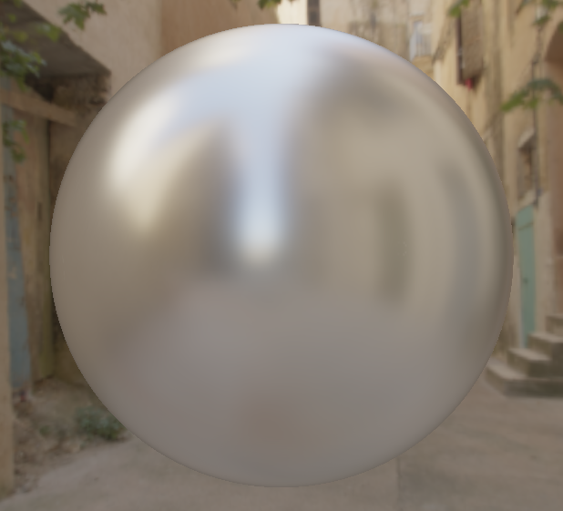</td>
  </tr>
  <tr>
    <th scope="row">100% Roughness</th>
    <td>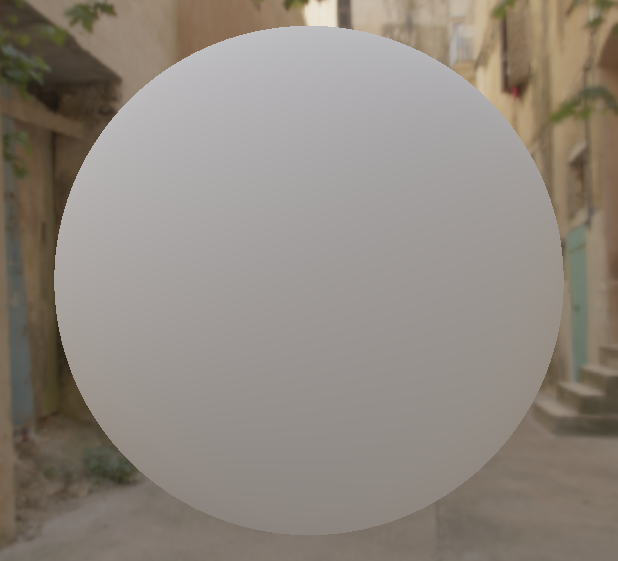</td>
    <td>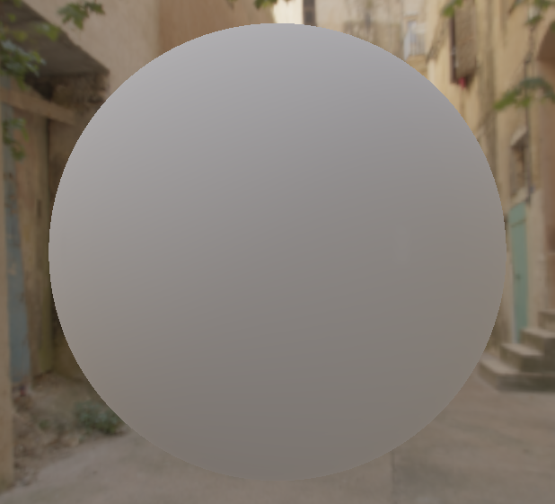</td>
    <td>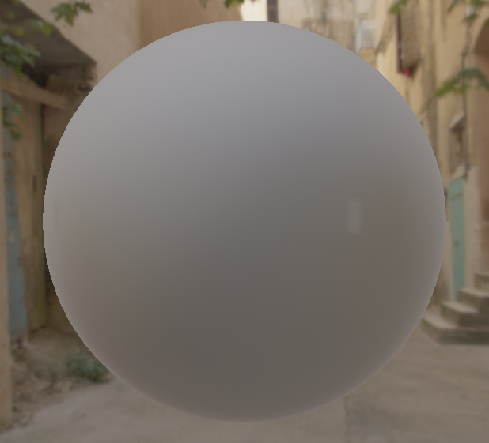</td>
  </tr>
</table>
